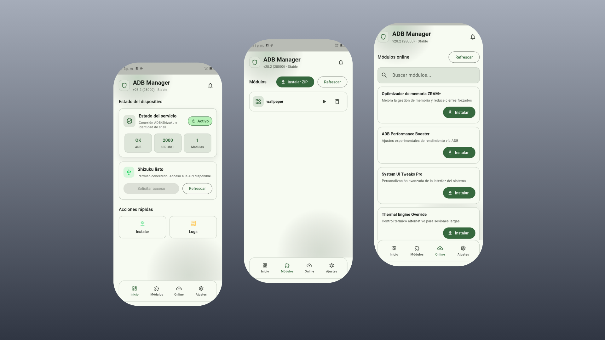

# ADB Manager



Gestor de módulos y scripts vía Shizuku/ADB. Permite instalar módulos desde ZIP (local u online), ejecutarlos con permisos Shizuku y ver logs en tiempo real.

## Información técnica
- **Paquete Android:** `com.lozanoth.adbmanager`
- **Permisos:** `INTERNET`, `CAMERA`, `WRITE_EXTERNAL_STORAGE` (maxSdk 28)
- **Canales nativos:**
  - `MethodChannel`: `shizuku`
  - `EventChannel`: `shizuku_logs`
- **Ruta de módulos (almacenamiento externo de la app):**
  - `Android/data/com.lozanoth.adbmanager/files/modules`

## Requisitos
- Android con **Shizuku** funcionando (modo ADB).
- Conceder permiso a la app dentro de Shizuku.

## Cómo funciona
1. **Instalar módulo**: selecciona un ZIP o descarga desde Online.
2. **Extraer módulo**: se descomprime en la carpeta `.../files/modules/<nombre>`.
3. **Ejecutar**: se llama a `main.sh` vía Shizuku.
4. **Desinstalar**: se ejecuta `uninstall.sh` y se elimina la carpeta.

El log de ejecución se muestra en un modal (tiempo real) y se cierra automáticamente al terminar.

## Formato del módulo
Dentro del ZIP:
```
<modulo>/
  main.sh
  uninstall.sh
  (otros archivos)
```
`main.sh` es obligatorio para ejecutar. `uninstall.sh` es opcional.

## Módulos Online
La app descarga un JSON desde:
```
https://lozanoth.github.io/modulos-adb-manager/modules.json
```

### Estructura del JSON
Formato recomendado:
```json
[
  {
    "name": "Nombre del módulo",
    "description": "Descripción corta",
    "zip_url": "https://tu-servidor/modulos/modulo.zip"
  }
]
```
También acepta:
- `description` como `desc`
- `zip_url` como `url` o `zip`
- Lista dentro de `{ "modules": [ ... ] }`

## Uso rápido
1. Abrir la app.
2. Dar permiso en Shizuku.
3. Ir a **Módulos** o **Online**.
4. Instalar y ejecutar.

## Cómo dar permisos (Shizuku)
1. Instala y abre **Shizuku**.
2. Inicia el servicio en modo **ADB** (requiere conexión por USB o ADB inalámbrico).
3. Abre **ADB Manager** y toca **Solicitar acceso**.
4. En Shizuku, acepta el permiso para la app.
5. En **Estado del servicio** debe aparecer **Activo** y **ADB: OK**.

## Uso para usuarios
### Instalar un módulo desde ZIP
1. Ve a **Módulos**.
2. Toca **Instalar ZIP** o usa **Acciones rápidas > Instalar**.
3. Selecciona el archivo `.zip`.
4. El módulo aparecerá en la lista.

### Ejecutar un módulo
1. En la lista de módulos, toca **Ejecutar**.
2. Se abrirá un modal con logs en tiempo real.
3. Al terminar, el modal se cerrará automáticamente.

### Desinstalar un módulo
1. En la lista de módulos, toca **Desinstalar**.
2. Se ejecuta `uninstall.sh` y se elimina la carpeta.

### Instalar módulos online
1. Ve a **Online**.
2. Usa el buscador si necesitas.
3. Toca **Instalar** en el módulo deseado.

## Limitaciones
- Shizuku **no** inicia módulos al arrancar el dispositivo (solo al abrir la app).
- Sin permiso de Shizuku, no se pueden ejecutar scripts.

## Ejecutar en desarrollo
```bash
flutter pub get
flutter run
```
